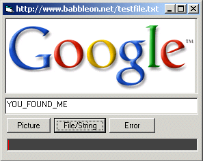



## No Winsock Or Inet Downloader\!\!

### Description

This is a complete event driven implementation of the usercontrol's asynchronous downloading capabilitys. Theres already some similar examples but none are very complete. This is great because you can add downloading to your app with no need for winsock or any other control... Just add the control to your project and your ready to go, you can download files, strings, pictures, and even open local files this way. enjoy
 
### More Info
 

             |
---                |---
**Submitted On**   |2003-09-02 20:07:42
**By**             |[Deth](https://github.com/Planet-Source-Code/PSCIndex/blob/master/ByAuthor/deth.md)
**Level**          |Beginner
**User Rating**    |5.0 (15 globes from 3 users)
**Compatibility**  |VB 6\.0
**Category**       |[OLE/ COM/ DCOM/ Active\-X](https://github.com/Planet-Source-Code/PSCIndex/blob/master/ByCategory/ole-com-dcom-active-x__1-29.md)
**World**          |[Visual Basic](https://github.com/Planet-Source-Code/PSCIndex/blob/master/ByWorld/visual-basic.md)
**Archive File**   |[No\_Winsock163988922003\.zip](https://github.com/Planet-Source-Code/deth-no-winsock-or-inet-downloader__1-48187/archive/master.zip)

